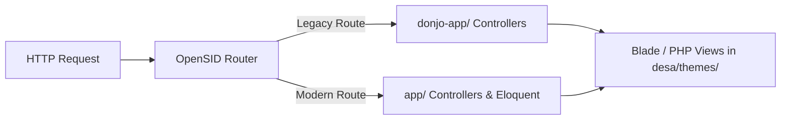

# OPENSID ARCHITECTURE DOCTRINE

Konteks: Dokumen doktrin arsitektur teknis dan aturan pengkodean untuk repositori OpenSID CintaMulya. Terhubung ke [[INDEX]].

## 1. DUAL-FRAMEWORK HYBRID ARCHITECTURE

OpenSID beroperasi dalam lingkungan hybrid:
- **CodeIgniter 3 Core (`donjo-app/`)**: Menangani legacy routing, database active record legacy, dan helper internal.
- **Laravel 10 Infrastructure (`app/`)**: Menangani Eloquent ORM, Service Layer, Blade Engine, dan Artisan Command.

## 2. ATURAN PENGEMBANGAN TEMA (DESA THEMES)

- Semua modifikasi visual dan layout desa MUST disimpan di `desa/themes/cintamulya/`.
- STRICTLY FORBIDDEN mengubah berkas tampilan core di `donjo-app/views/` atau `storage/app/themes/` secara langsung jika dapat di-override melalui tema `cintamulya`.
- Berkas Blade views harus mengikuti aturan format `prettier-blade` (`npm run blade`).

## 3. HYGIENE REPOSITORI & GIT PROTOCOL

- Berkas kualifikasi lingkungan lokal, cache, atau IDE (seperti `.claude/`, `.idea/`, `.vscode/`, `*.log`, `.cache-rector/`) MUST dimasukkan ke `.gitignore`.
- Berkas memori proyek (`_memory/`) dan doktrin (`_doctrine/`) MUST tetap dilacak oleh Git agar seluruh agen dan pengembang berbagi konteks yang sama.
- Eksekusi `git commit` dan `git push` hanya boleh dilakukan jika ada instruksi eksplisit dari pengembang/pengguna.
