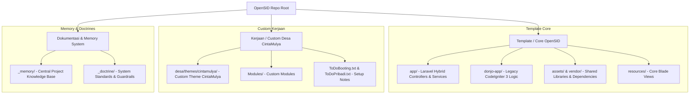

# Central Map: OpenSID CintaMulya Workspace

Konteks: Peta Utama repositori OpenSID Desa Cinta Mulya. Dokumen ini menghubungkan seluruh struktur repositori dan membedakan kode dasar (template) dengan hasil kerja spesifik desa (kerjaan).

## Architecture & Code Base Overview

## Separasi Kode (Template vs. Kerjaan)

| Kategori | Path Files & Folder | Deskripsi & Tujuan | Risk Level Saat Update |
| :--- | :--- | :--- | :--- |
| **Template** | `donjo-app/`, `app/`, `vendor/`, `bootstrap/`, `config/` | Core framework OpenSID (CodeIgniter 3 + Laravel 10 Hybrid). Diperbarui secara berkala dari upstream OpenSID. | High (Jangan modifikasi langsung jika bisa di-override) |
| **Kerjaan** | `desa/themes/cintamulya/` | Tema kustom khusus Desa Cinta Mulya. Aman dari overwrite pembaruan rilis OpenSID. | Low (Area kerja utama frontend desa) |
| **Kerjaan** | `Modules/` (`Anjungan`, `Analisis`, `BukuTamu`, `Kehadiran`, `Lapak`, `Pelanggan`) | Modul-modul kustom aktif untuk fitur desa. | Medium (Tergantung integrasi ke core OpenSID) |
| **Memory** | `_memory/` (`INDEX.md`, `CHANGELOG.md`, `DIARY.md`) | Catatan status project, log perubahan, dan keputusan arsitektur. | Safe (Dipertahankan di Git) |
| **Doctrine** | `_doctrine/` (`OPENSID_ARCHITECTURE_DOCTRINE.md`) | Panduan arsitektur dan aturan teknis workspace. | Safe (Dipertahankan di Git) |

## Related Memory Files

- Untuk riwayat perubahan sistem dan repositori, lihat [[CHANGELOG]].
- Untuk catatan keputusan arsitektur, bug findings, dan analisis tema, lihat [[DIARY]].
- Untuk standar teknis dan panduan pengembangan, lihat [[OPENSID_ARCHITECTURE_DOCTRINE]].
